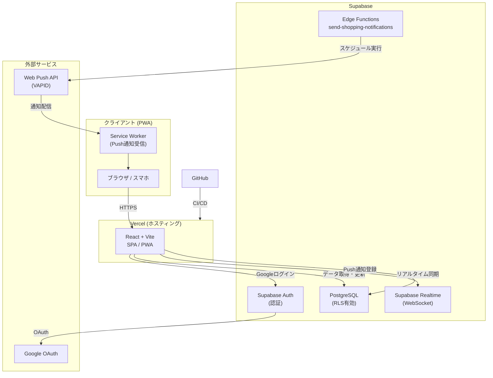
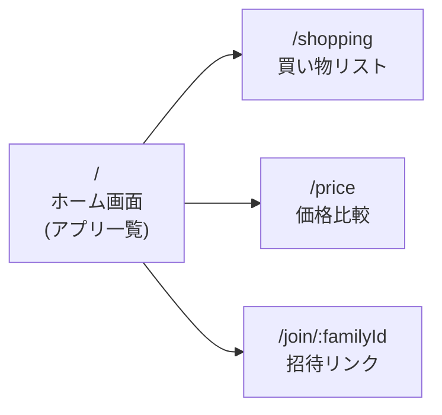
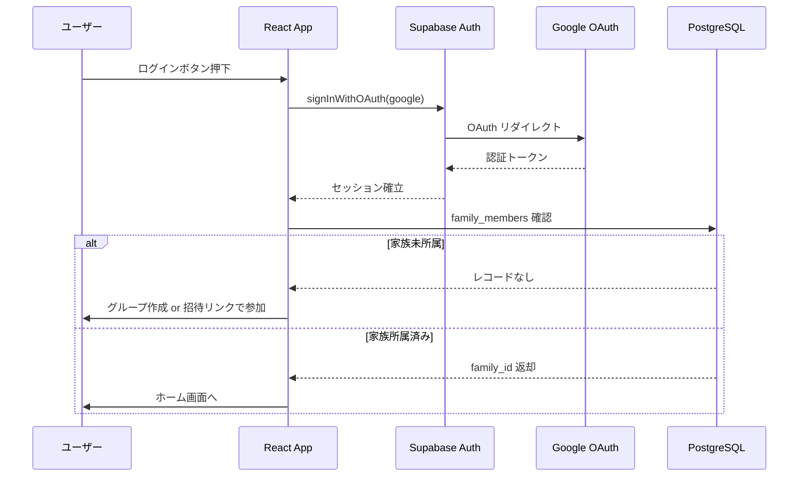
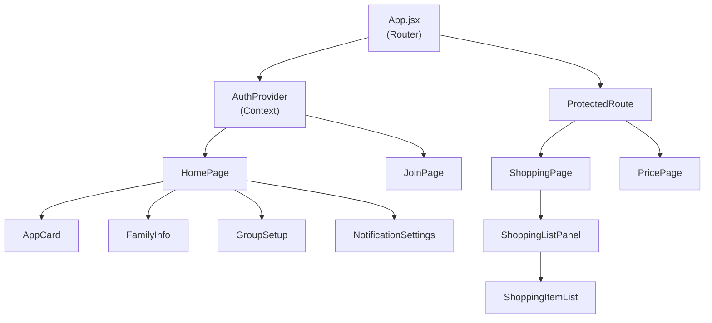
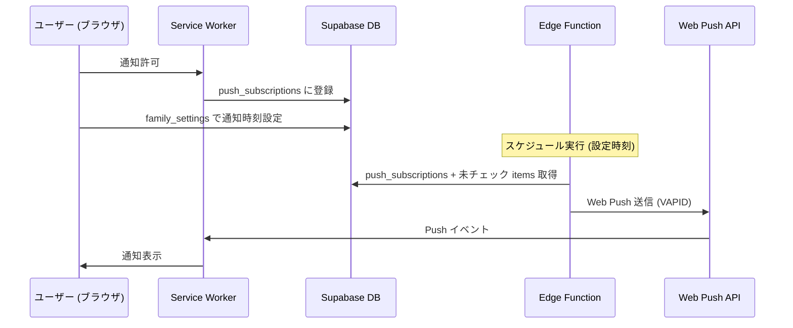

# システム構成図

## 全体アーキテクチャ



---

## ページ構成・ルーティング



| パス | ページ | 認証要否 |
|------|--------|----------|
| `/` | ホーム（アプリ一覧） | 不要 |
| `/shopping` | 買い物リスト | 必要 |
| `/price` | 価格比較 | 必要 |
| `/join/:familyId` | 家族参加（招待リンク） | 不要 |

---

## 認証・家族グループ フロー



---

## データベース設計

```mermaid
erDiagram
    families {
        uuid id PK
        text name
        timestamp created_at
    }

    family_members {
        uuid id PK
        uuid family_id FK
        uuid user_id UK
        text name
        text email
        timestamp joined_at
    }

    shopping_lists {
        uuid id PK
        uuid family_id FK
        text name
        text created_by
        timestamp created_at
    }

    shopping_items {
        uuid id PK
        uuid list_id FK
        text name
        text memo
        text added_by
        boolean checked
        boolean important
        timestamp created_at
    }

    price_stores {
        uuid id PK
        uuid family_id FK
        text name
        integer sort_order
    }

    price_items {
        uuid id PK
        uuid family_id FK
        text store_name
        text product_name
        integer price
        text note
        text updated_by
        timestamp updated_at
    }

    push_subscriptions {
        uuid id PK
        uuid user_id FK
        uuid family_id FK
        text endpoint
        text p256dh
        text auth
        timestamp created_at
    }

    family_settings {
        uuid family_id PK_FK
        boolean notification_enabled
        integer notification_hour
        timestamp updated_at
    }

    families ||--o{ family_members : "has"
    families ||--o{ shopping_lists : "has"
    families ||--o{ price_stores : "has"
    families ||--o{ price_items : "has"
    families ||--o{ push_subscriptions : "has"
    families ||--|| family_settings : "has"
    shopping_lists ||--o{ shopping_items : "contains"
```

---

## フロントエンド コンポーネント構成



---

## Push通知 フロー



---

## 技術スタック

| レイヤー | 技術 |
|----------|------|
| フロントエンド | React 18 + Vite |
| PWA | vite-plugin-pwa + Service Worker |
| 認証 | Supabase Auth (Google OAuth) |
| データベース | Supabase (PostgreSQL) + RLS |
| リアルタイム | Supabase Realtime (WebSocket) |
| バックエンド | Supabase Edge Functions (Deno) |
| Push通知 | Web Push API (VAPID) |
| ホスティング | Vercel (GitHub 自動デプロイ) |

---

## セキュリティ設計

- **Row Level Security (RLS)**: 全テーブルに適用。`get_my_family_id()` ヘルパー関数で家族スコープを強制
- **認証**: Supabase Auth セッションによる JWT 検証
- **招待リンク**: `families` テーブルの SELECT を認証済みユーザー全体に許可（参加フローのため）
- **Push通知**: VAPID キーによる署名、エンドポイントはユーザー自身のみ管理可能
