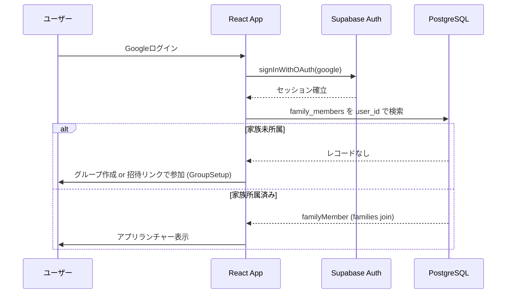
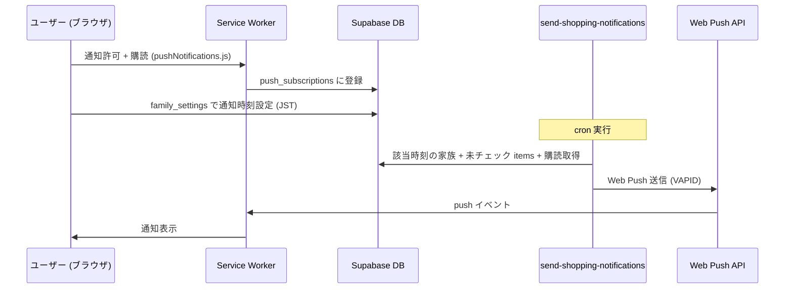

# ARCHITECTURE.md — システム構成

## 全体アーキテクチャ

```mermaid
graph TB
    subgraph Client["クライアント (PWA)"]
        Browser["ブラウザ / スマホ"]
        SW["Service Worker\n(sw-push.js: Push通知受信)"]
    end

    subgraph Vercel["Vercel (ホスティング)"]
        React["React 19 + Vite 7\nSPA / PWA"]
    end

    subgraph Supabase["Supabase"]
        Auth["Supabase Auth\n(Google OAuth)"]
        DB["PostgreSQL\n(全テーブル RLS 有効)"]
        Realtime["Supabase Realtime\n(WebSocket)"]
        Storage["Storage\n(dish-thumbnails)"]
        Edge["Edge Functions\nfetch-og-image\nsend-shopping-notifications"]
    end

    subgraph External["外部サービス"]
        Google["Google OAuth"]
        Maps["Google Maps JS API"]
        WebPush["Web Push API\n(VAPID)"]
    end

    GitHub["GitHub (main)"] -->|自動デプロイ| Vercel

    Browser -->|HTTPS| React
    React -->|Googleログイン| Auth
    Auth -->|OAuth| Google
    React -->|CRUD (RLS適用)| DB
    React -->|リアルタイム同期| Realtime
    React -->|functions.invoke| Edge
    React -->|地図表示| Maps
    Edge -->|OG画像保存| Storage
    Edge -->|定時Push送信| WebPush
    WebPush -->|通知配信| SW
    SW --> Browser
```

## レイヤー構成と責務

| レイヤー | 実装 | 責務 |
|---|---|---|
| ルーティング | `src/App.jsx` | 全ルート定義。保護ページは `<ProtectedRoute>` |
| グローバル状態 | `src/contexts/AuthContext.jsx` | `user`（Supabase auth）と `familyMember`（家族所属）。唯一の Context |
| ページ | `src/pages/*Page.jsx` | データ取得・Realtime 購読・楽観的更新・画面構成 |
| コンポーネント | `src/components/` | 表示部品。props 駆動（[COMPONENTS.md](./COMPONENTS.md)） |
| 外部クライアント | `src/lib/` | supabase クライアント、Push 購読管理 |
| ユーティリティ | `src/utils/` | Google Maps ローダー等の純関数・シングルトン |
| 認可 | Supabase RLS | `get_my_family_id()` による家族スコープ強制（[DATABASE.md](./DATABASE.md)） |
| サーバー処理 | `supabase/functions/` | OG 画像取得・定時 Push 通知（[API.md](./API.md)） |

## ルーティング

全ルートは [FEATURES.md](./FEATURES.md) を参照。公開ルートは `/`（ホーム）と `/join/:familyId`（招待リンク）のみ。他はすべて `<ProtectedRoute>` 配下。

## 認証・家族グループ フロー



- 1 ユーザー = 最大 1 家族（`family_members.user_id` unique）
- 招待は URL 共有方式: `/join/:familyId`。UUID の推測困難性に依存するため、`families` の SELECT のみ認証済み全員に許可

## データフローの基本形

1. ページマウント → `familyMember.family_id` で初期フェッチ
2. `supabase.channel().on('postgres_changes', { filter: family_id })` で購読 → 変更検知時は**再フェッチ**（差分適用しない）
3. ユーザー操作 → **楽観的 UI 更新** → Supabase 書き込み → エラー時ロールバック
4. 他の家族メンバーには Realtime 経由で反映

具体的なコードパターンは [API.md](./API.md)。

## Push 通知フロー



## データベース

テーブル定義・RLS・マイグレーション運用はすべて [DATABASE.md](./DATABASE.md) に集約。

## ビルド・デプロイ

- `npm run build` → Vite ビルド + vite-plugin-pwa が SW / manifest を生成（`public/sw-push.js` を `importScripts` で注入）
- `main` ブランチへの merge → Vercel が自動デプロイ
- **マイグレーションと Edge Functions のデプロイは自動化されていない**（手動適用。[DATABASE.md](./DATABASE.md) / [API.md](./API.md) 参照）

## セキュリティ設計

- **RLS**: 全テーブル適用。`get_my_family_id()`（security definer）で家族スコープ強制
- **認証**: Supabase Auth の JWT。anon キーは RLS 前提で公開可
- **service_role キー**: Edge Functions 内のみ。クライアント露出禁止
- **招待リンク**: UUID 推測困難性 + 1 ユーザー 1 家族制約
- **Push**: VAPID 署名。購読は本人のみ管理可（`user_id = auth.uid()`）
